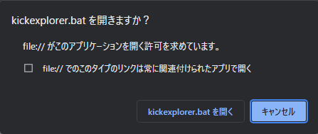

# What's this ?

# Install

# Run

  

//todo 確認  
設定を元に戻すには、
`C:\Users\(ユーザー名)\AppData\Local\Google\Chrome\User Data\Default\Preferences` の、`"allowed_origin_protocol_pairs":` の項目 `{"file://":{"kickexplorer":true}}` を削除する  

# Uninstall

# Restrictions

 - install.bat, uninstall.bat ともに SJIS 環境しか想定していません。  
   (コマンドプロント環境がデフォルトだと SJIS のため。)  

   todo uninstall.bat でレジストリエントリの既定エントリかどうかを評価するために、'名前' が `(既定)` かどうかで評価しているため
   todo フォルダ選択ダイアログで `キャンセル` されたかどうかを判断するため

# Developing policies

 - Windows で動作すればいい
 - Microsoft Offece は使わない (使いたくない & 頼りたくない)
 - ウェブブラウザは Chrome でだけ動作確認できればいい
 - ブラウザでリンククリック -> エクスプローラー起動は[カスタム URI](https://learn.microsoft.com/ja-jp/windows/uwp/launch-resume/launch-default-app) を利用する (他に簡単でスマートな実装ができる方法が見つからないため)
 - 起動されるアプリはバッチファイル `kickexplorer.bat` で統一 (install.bat, uninstall.bat, WhatsNew.ps1 でそれぞれ定義。なにかしらのファイル / レジストリを参照して共有はめんどくさいので)
 - カスタム URI スキーム名は `kickexplorer` で統一 (install.bat, uninstall.bat, WhatsNew.ps1 でそれぞれ定義。なにかしらのファイル / レジストリを参照して共有はめんどくさいので)
 - レジストリアクセスは、.bat ファイル内で `reg` する事で処理。(.reg ファイルは使わない。インストールディレクトリを動的に処理したいため。)
 - 
## 動作順序

### Install

1. コードページを `SJIS` に設定 (フォルダ選択ダイアログで `キャンセル` されたかどうかを判断するための評価文字列 `ECHO は <OFF> です。` を使用するため)
2. インストール先ディレクトリをダイアログで選択 (ディレクトリ選択状態はフォルトで `C:\Users\(ユーザー名)\Documents\kickexplorer` としたいが、方法がわからないので対応しない)
3. ダイアログがキャンセルされたかどうかを判定 -> キャンセルされた場合は、メッセージを表示して終了 -> pause
4. 選択したディレクトリが存在しないかどうか確認 -> 存在しない場合は、メッセージを表示して終了 -> pause
5. 選択したディレクトリ配下にすでに `kickexplorer` が存在しないかどうか確認 -> 存在する場合は、メッセージを表示して終了 -> pause
6. カスタム URI スキーム用レジストリ登録 (`kickexplorer.bat` のコピー前にレジストリアクセスが可能かどうか確認する目的で、ファイルコピー前にやる)
7. 選択ディレクトリ配下にこの PJ 配下の `kickexplorer` を再起的にコピー -> アクセスが拒否され場合は、メッセージを表示して終了 -> pause
8. メッセージを表示して pause

### Run

1. 任意のフォルダにバッチファイルを配置 & 好きなときにバッチを叩く (カスタム URI のインストール済み確認はしない。.html ファイルの生成には影響無いため。インストールされていない場合はブラウザでリンククリック後にエラーが発生するはずなので、そこで気づく //todo 本当？)
2. バッチファイルのが配置されたディレクトリから規定の深さのディレクトリを走査 (todo 特定のディレクトリ・ファイルは ignore できるようにしたい) (ディレクトリ一覧を簡単に取得・操作したいので、 Powershell で実施。ただし起動は .bat 。Powershell は実行ポリシーがデフォルトで `Restricted` なため。)
3. タイムスタンプ (更新日時) の降順でソートされた表が .html ファイルに書き込む (ファイルは強制上書きで OK。 .html ファイルはブラウザでしか開くつもりがないので、ファイルのロックはされない想定)
4. .html ファイルをブラウザで開いてリンクをクリックするとカスタム URI が動作 -> install.bat で登録されたバッチファイル kickexplorer.bat が起動する
5. kickexplorer.bat から kickexplorer.ps1 を起動して引数を URL デコード -> explorer.exe への引数に指定してファイルエクスプローラーを起動 (URL デコードは、簡単に実装したいので Powershell で処理。ただし起動は .bat 。Powershell は実行ポリシーがデフォルトで `Restricted` なため。) -> パスが存在しない場合はメッセージを表示して pause (.html ファイル作成後にパスが削除されていた場合を想定)

### Uninstall

1. コードページを `SJIS` に設定 (レジストリエントリの '名前' が `(規定)` の場合かどうかを判断するため)
2. レジストリを参照してインストール先ディレクトリ名を抽出 -> レジストリアクセスが拒否 / エントリが存在しない場合は、アンインストール済みと見なす。メッセージを表示して終了 -> `pause`
3. レジストリの削除 -> レジストリへのアクセスが拒否された場合は、メッセージを表示して終了 -> `pause`
4. インストール先のディレクトリ `kickexplorer` が存在しない場合はすでに削除されているのでどうしようもない。 -> 正常終了
5. インストール先のディレクトリ削除 -> 失敗した場合は、メッセージを表示して終了 -> `pause` (ディレクトリが BISY 状態の時を想定)
6. メッセージを表示して pause

# Todo

 - kickexplorer.bat の起動でコマンドプロントが出てきて鬱陶しい (パスが存在しない場合はエラーを表示捺せ無ければいけないのでしょうがない？)
 - kickexplorer.ps1 内で `Write-Error` 時にエラー発生箇所まで表示されてしまう (エラーメッセージは表示したい)
